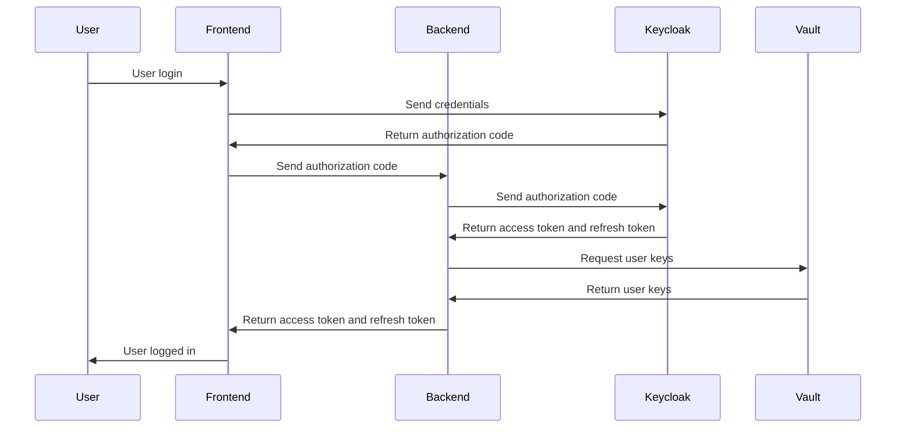

# Authentication Model

Cafe Variome V3 uses multiple authentication token and keys to ensure the user has permission to perform actions. This wiki page explains the flow and tokens involved in authenticating a user.

## User login flow

The user login flow can be represented in the following diagram:

<procedure title="User authentication flow">
    <step>User enters the login page, input the user name and password, and click login.</step>
    <step>In application mode, the front end will mimic the redirect flow and get auth code; in web mode, the KeyCloak will handle the redirecting with the auth code. Either way, the front end will acquire the auth code.</step>
    <step>Front end sends the auth code to the backend, and the backend will exchange the auth code for an access token and a refresh token.</step>
    <step>
        The backend will validate:
        <list type="bullet">
            <li>The access token is valid and not expired.</li>
            <li>The user ID provided by KeyCloak is in the database.</li>
            <li>The user ID has a corresponding key inside the vault, in transit engine.</li>
        </list>
        If all the above is satisfied, the user is permitted to login to this instance. Otherwise, the automatic registration may happen, depending on the configuration.
    </step>
    <step>The backend will send both the access token and refresh token to the front end. Upon receiving the tokens, front end considers the login successful, and will store the tokens in memory. No sensitive information is stored in persistent storage or cookies.</step>
</procedure>

## User logout flow

User log out is straightforward. The front end sends the logout request to KeyCloak, with the refresh token. Whatever the response from KeyCloak, this session is considered terminated. Since if the refresh token is invalid, the session is already expired.

There's also the case of passive logout. This happens when the access token is invalid, and refresh token is expired. Upon refresh error, or backend returns 401 (which denotes bad token in this system, while 403 is used for login acknowledged, but no permission to perform action), the front end logs out the user without sending the logout request.

Upon logout, the state of the front end is reset, with all memory values lost. The configurations set in shared preference will still remain, with the theme color, etc. remains the same. This provides a consistent experience for the user.

## Federated authentication for a user

When a user queries in an instance, his query will be sent out to other instances in the same network, should there be any network or instance. In the request, multiple headers are set to authenticate the server, the user, and ensure the secure transmittion of the data. The request header contains:

- ``Authorization``: The access token of the user, to authenticate the user.
- ``X-Installation-ID``: The installation ID of the instance, for the recepient to know where the query comes from.
- ``X-Network-ID``: The network used to transmit this request. This is a logic network that is not necessarily the same as the physical network. This is used to determine the resources available to this user in this network.
- ``X-User-ID``: The user ID of the user. This is not necessary if the token can be accepted in the receipient, but in the case of the token cannot be verified, the receipient might need this ID to determine the user's permission.
- ``X-Server-Signature``: A signature generated from the payload, with the server's private key. The public key of the server has been propogated through the network. This is used to verify the server is what it claims, and the payload is not tampered with.
- ``X-Query-ID``: The ID of the query. The receipient may respond with accepted but not processed, in case of the same query has been sent to this instance by another server. In decentralized network design, there's no traffic control.
- ``X-Relay-ID``: The ID of this server, in case the original server is not this one. This is used to determine the path of the query, and potentially use the relay as a caching point, when the original server is not reachable.

The query will only be processed if all the header checks out, and the user has correct permission in the database. When the result is generated, it's sent back encrypted. The encryption is done with the public key of the user, which is pre-propogated and stored in the vault. This is also to ensure that if the server and user is impersonated, the data cannot be decrypted.

The network is built to be as close to zero trust as possible. In future, a validator might be necessary, to validate the source code integrity of the system.

## Federated authentication for a server

When a server needs to perform sync operations on another server, it needs to be authenticated as well. The authentication is the same as the federated user authentication, except this time the access token is service account access token, and the query ID and user ID is not present.
