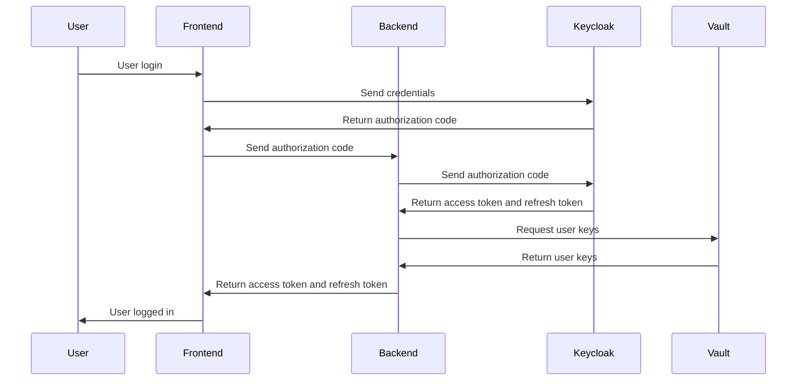

# Authentication Model

Cafe Variome V3 uses a combination of authentication tokens and keys to verify user permissions. This wiki page explains the flow and tokens involved in authenticating a user.

## User login flow

The user login flow can be represented in the following diagram:

<procedure title="User authentication flow">
    <step>User enters the login page, inputs their username and password, and clicks login.</step>
    <step>In application mode, the front end will mimic the redirect flow and get the auth code; in web mode, the KeyCloak will handle the redirecting with the auth code. Either way, the front end will acquire the auth code.</step>
    <step>The front end sends the auth code to the backend, then the backend exchanges the auth code for an access token and a refresh token.</step>
    <step>
        The backend will validate that:
        <list type="bullet">
            <li>The access token is valid and has not expired.</li>
            <li>The user ID provided by KeyCloak is in the database.</li>
            <li>The user ID has a corresponding key inside the vault, in transit engine.</li>
        </list>
        If all the above is satisfied, the user is permitted to login to this instance. Otherwise, the automatic registration may happen, depending on the configuration.
    </step>
    <step>The backend will send both the access token and refresh token to the front end. Upon receiving the tokens, front end considers the login successful, and will store the tokens in memory. No sensitive information is stored in persistent storage or cookies.</step>
</procedure>

## User logout flow

User logout is a straightforward process. The frontend sends a logout request to Keycloak along with the refresh token. Regardless of Keycloak’s response, the session is considered terminated, as an invalid refresh token indicates the session has already expired.

Passive logout occurs when the access token is invalid and the refresh token has expired. If a refresh attempt fails or the backend returns a 401 error (indicating a bad token in this system, whereas 403 signifies a valid login but insufficient permissions), the frontend logs out the user without sending a logout request.

Upon logout, the frontend state is reset, and all in-memory values are lost. However, configurations stored in shared preferences, such as the theme color, remain unchanged, ensuring a consistent user experience.

## Federated authentication for a user

When a user submits a query in an instance, it is forwarded to other instances within the same network, if any exist. The request includes multiple headers to authenticate the server and user while ensuring secure data transmission. The request headers include:

- ``Authorization``: The user's access token, used for authentication.
- ``X-Installation-ID``: The unique installation ID of the instance, allowing the recipient to identify the source of the query.
- ``X-Network-ID``: The logical network used to transmit the request, which may differ from the physical network. This is used to determine the resources available to the user within the network.
- ``X-User-ID``: The user's unique ID. This is not required if the recipient can validate the token, but if token verification fails, the recipient may use this ID to determine the user's permissions.
- ``X-Server-Signature``: A signature generated from the payload using the server's private key. The server's public key is distributed across the network, allowing recipients to verify the server's identity and ensure the payload has not been tampered with.
- ``X-Query-ID``: The unique identifier for the query. The recipient may acknowledge the request as accepted but not processed if the same query has already been received from another server. In a decentralized network, where there is no traffic control, this helps prevent redundant processing.
- ``X-Relay-ID``: The ID of this server, used when it is not the original sender. This is used to determine the path of the query, and potentially use the relay as a caching point, when the original server is not reachable.

The query is processed only if all headers are valid and the user has the correct permissions in the database. Once the result is generated, it is sent back encrypted using the user's public key, which is pre-propagated and stored in the vault. This ensures that even if the server or user is impersonated, the data remains secure and cannot be decrypted.

The network is built to be as close to zero trust as possible. In future, a validator might be necessary, to validate the source code integrity of the system.

## Federated authentication for a server

When a server performs sync operations on another server, it must also be authenticated. The authentication process is the same as for federated user authentication, but in this case, a service account access token is used, and the query ID and user ID are not included.

<seealso>
    <category ref="related">
        <a href="authentication.md"/>
        <a href="keycloak-credentials-and-account.md"/>
        <a href="federated-authentication.md"/>
    </category>
</seealso>