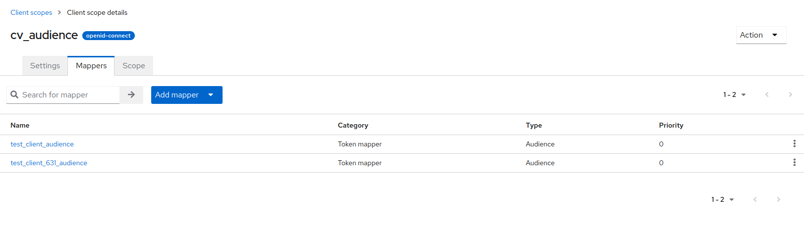

# Dependent Services Configuration

Cafe Variome V3 requires several services to be running in order to function properly. They are databases, storages, and identity providers.

## MongoDB

MongoDB is a schemaless, NoSQL database that Cafe Variome V3 uses to store data. All operational data and discoverable data are stored in MongoDB.

### Installing MongoDB as package

Official document can be found [here](https://www.mongodb.com/docs/manual/administration/install-on-linux/). For Ubuntu, it can be installed via a custom source:

```bash
sudo apt install gnupg curl
curl -fsSL https://www.mongodb.org/static/pgp/server-7.0.asc | sudo gpg -o /usr/share/keyrings/mongodb-server-7.0.gpg --dearmor
echo "deb [ arch=amd64,arm64 signed-by=/usr/share/keyrings/mongodb-server-7.0.gpg ] https://repo.mongodb.org/apt/ubuntu jammy/mongodb-org/7.0 multiverse" | sudo tee /etc/apt/sources.list.d/mongodb-org-7.0.list
sudo apt update
sudo apt install mongodb-org
```

### Using MongoDB Docker

The minimal setup for docker would be:

```yaml
services:
  mongodb:
    image: mongo:7.0.11
    restart: always
    ports:
      - "27017:27017"
    volumes:
      - mongodb-data:/data/db

volumes:
  mongodb-data:
```

### Configuring MongoDB

MongoDB supports authentication. It is recommended to enable authentication for production use. The corresponding configuration section of CV3 is:

```json
{
  "MongoDB": {
    "Host": "localhost",
    "Port": "27017",
    "User": "cafevariome",
    "Password": "cafevariome",
    "Database": "cafevariome",
    "MaxJobs": 40
  }
}
```

If authentication is not enabled, the username and password can be left empty, or use anything.

## Redis

Redis is a high speed in-memory cache storage that Cafe Variome V3 uses as a message broker and inter-process cache.

### Installing Redis as package

Redis comes with most distributions' package managers. For Ubuntu, it can be installed via:

```bash
sudo apt update
sudo apt install redis
sudo systemctl enable redis --now
```

### Using Redis Docker

The minimal setup for docker would be:

```yaml
services:
  redis:
  image: redis:7.4
  restart: always
  ports:
    - '6379:6379'
  command: redis-server
  volumes: 
    - ./data/redis:/data

volumes:
  redis-data:
```

### Configuring Redis

Redis do not use username/password authentication, but rather a ACL system. For now, CV3 do not support such authentication method, and only supports redis without authentication.

Redis may also be configured as a cluster. When using a redis cluster, set the `cluster` option in CV3 configuration to `true`.

## Keycloak

Keycloak is an open source OIDC identity provider that Cafe Variome V3 uses to authenticate users. CV3 integrates with Keycloak deeply, not only by using the OIDC protocol, but also uses its REST API to manage users, tokens and clients. It currently cannot use a different OIDC server.

### Using Keycloak docker

It's recommended to use Keycloak with docker. Otherwise, the server should be specifically hardened, and Keycloak should be run as a service to ensure availability and security.

```yaml
services:
  keycloak:
    image: quay.io/keycloak/keycloak:23.0
    deploy:
      restart_policy:
        condition: always
        delay: 5s
        window: 120s
    ports:
      - '8080:8080'
    depends_on:
      - keycloak_db
    command: start-dev --db mariadb --db-url-host keycloak_db --db-username keycloak_docker --db-password KeyCloakPassword1234 --http-port 8080
    environment:
      DB_VENDOR: mariadb
      DB_ADDR: keycloak_db
      DB_PORT: 3306
      DB_DATABASE: keycloak
      DB_USER: keycloak_docker
      DB_PASSWORD: KeyCloakPassword1234
      KEYCLOAK_ADMIN: admin
      KEYCLOAK_ADMIN_PASSWORD: KeyCloakPassword1234

  keycloak_db:
    image: mariadb:lts-jammy
    environment:
      MYSQL_ROOT_PASSWORD: KeyCloakPassword1234
      MYSQL_DATABASE: keycloak
      MYSQL_USER: keycloak_docker
      MYSQL_PASSWORD: KeyCloakPassword1234
    restart: always
    volumes:
      - keycloak-db:/var/lib/mysql

volumes:
  keycloak-db:
```

This set up is for a dev server. For production use, you need to use `start` instead of `start-dev`, and may need to configure Java keystore for SSL, as well as other security settings.

### Configuring Keycloak

Cafe Variome V3 requires a service account with sufficient privileges to perform user management and token manipulation operations. These roles are (they may belong to different clients):

- view-users
- manage-users (optional if need to create users)
- read-token
- manage-account
- manage-account-links
- view-groups
- view-applications
- delete-account
- view-profile

If you wish to use the Nexus mode (which manages multiple CV2 instances), you will also need to assign the following roles:

- create-client
- manage-clients
- view-clients

Specifically, for federated authentication, a client role needs to be created with audience mappers to all clients that needs to use this feature. The role is then to be assigned to these clients as default client role. This allows their access token contains the others as audience. An example is:



The two clients are the ones assumed that will be used for federated authentication.

To set up the credentials in KeyCloak 21+, follow the steps below:

<procedure title="Create credentials in KeyCloak 21+">
   <p>To set up the credentials in KeyCloak 21+, follow the steps below:</p>
   <step>Log in to KeyCloak as an administrator. The administrator account can be the global admin in master realm, or any admin account with the <code>realm-management</code> role in the realm you wish to use.</step>
   <step>Go to the realm you wish to use, and go to the <code>Clients</code> page.</step>
   <step>Click <code>Create client</code> button to create a new client.</step>
   <step>Set the client type to <code>Service account</code>, and the client ID, client name, description to something you wish to use. Click <code>Save</code> to save the client.</step>
   <step>In Capability config, enable <code>Client authentication</code>, <code>Standard flow</code> and <code>Service accounts roles</code>. For security purpose, it's recommended to disable <code>Direct access grants</code> and any other flow you do not use. Click <code>Next</code> to go to login settings.</step>
   <step>In Login settings, set all the URL to the URL you plan to host the service. Assume the domain to host the service is at <code>https://cv3.cafevariome.org</code>, the valid redirect URLs would be:
   <list>
      <li><code>https://cv3.cafevariome.org/callback.html</code></li>
      <li><code>https://cv3.cafevariome.org/callback-silent.html</code></li>
      <li><code>https://cv3.cafevariome.org/discover/callback.html</code></li>
      <li><code>https://cv3.cafevariome.org/discover/callback-silent.html</code></li>
      <li><code>https://cv3.cafevariome.org/meta-discover/callback.html</code></li>
      <li><code>https://cv3.cafevariome.org/meta-discover/callback-silent.html</code></li>
   </list>
   Wildcard may be used to ease the management of all URLs. However, due to the frontend code structure, these will be all the valid redirect URLs. Click <code>Save</code> to save the settings.</step>
   <step>Go to the configuration page for the newly created client, and select <code>Service accounts roles</code> tab. Click <code>Assign role</code> to assign the aforementioned roles to the client.</step>
   <step>Go to the <code>Client Scopes</code> page and create a new client scope, following instructions in the image above. Assign this role to the client as a default client role.</step>
   <step>Fine tune other settings for this client.</step>
   <p>Then the client should be ready to use by CV3.</p>
</procedure>

> The client secret, which is part of the client credentials, is one of the most important credential for CV3. DO NOT note it down in unsecure locations, and rotate it frequently. When running installation script, CV3 installer will ask for this secret, and store it securely in Vault.
> {style="note"}

## Vault

Vault is a powerful secret management tool that focuses on security. It's a web service that stores secrets, such as passwords, encryption keys, and other sensitive data. It stores everything in an encrypted form, and supports encryption / decryption as a service.

### Installing as a package

On some distributions, Vault can be installed via package manager. For Ubuntu, it can be installed like:

```bash
sudo apt update && sudo apt install gpg wget
wget -O- https://apt.releases.hashicorp.com/gpg | sudo gpg --dearmor -o /usr/share/keyrings/hashicorp-archive-keyring.gpg
echo "deb [arch=$(dpkg --print-architecture) signed-by=/usr/share/keyrings/hashicorp-archive-keyring.gpg] https://apt.releases.hashicorp.com $(lsb_release -cs) main" | sudo tee /etc/apt/sources.list.d/hashicorp.list
sudo apt update && sudo apt install vault
```

### Using binary

Vault is a self-contained binary that contains both the web service and a CLI tool to interact with the service. Refer to the official website to download the binary.

### Using Docker

Hashicorp provides an official docker image for Vault. It can be used like:

```yaml
services:
  vault:
    image: hashicorp/vault:1.17.2
    restart: always
    ports:
      - "8200:8200"
    cap_add:
      - IPC_LOCK
    environment:
      VAULT_LOCAL_CONFIG: '{"storage": {"file": {"path": "/vault/file"}}, "listener": [{"tcp": { "address": "0.0.0.0:8200", "tls_disable": true}}], "default_lease_ttl": "168h", "max_lease_ttl": "720h", "ui": true}'
    command: server
    volumes:
      - ./data/vault/file:/vault/file
```

The `IPC_LOCK` capability is mandatory for vault to work. The configuration of the vault can be supplied as an environment variable, or as a file. The above example uses environment variable.

### Configuration

Vault is a bit special in this setup, because every time it reboots, it needs to be unsealed. This can be done via some auto-unseal process, for example using AWS KMS, or Azure Key Vault. This is actually recommended, but for simplicity, we will use a simple unseal process.

1. Install the vault, configure it, and start the server. It's recommended to use high availability set up or auto unseal to ensure the availability of the vault server. Initialize and unseal the vault. For details on these steps, refer to [official vault documents](https://developer.hashicorp.com/vault/docs).
2. Enable kv store and transit engine for CV3, if not done so already. Run the following command (note that it's kv-v2, not kv):
    ```bash
    # Enable kv store
    vault secrets enable -path=kv kv-v2
    # Enable transit engine
    vault secrets enable -path=transit transit
    ```
3. Create a policy that allows the CV3 to access necessary paths. CV3 needs full permission on the designated kv engine path, as well as permission to list and remove metadata for the same path (to check the key status and to completely remove a key). It also needs full access to the transit engine. A sample policy would be (assume the kv engine is mounted at ``kv``, and the designated path is ``cv3``, while the transit engine is mounted at ``transit_cv3``):
    ```yaml
    path "kv/data/cv3" {
      capabilities = ["create", "update", "read", "delete", "list"]
    }
    path "kv/data/cv3/*" {
      capabilities = ["create", "update", "read", "delete", "list"]
    }
    path "kv/metadata/cv3" {
      capabilities = ["list", "delete"]
    }
    path "kv/metadata/cv3/*" {
      capabilities = ["list", "delete"]
    }
    path "transit_cv3/*" {
      capabilities = ["create", "update", "read", "delete", "list"]
    }
    ```
   The policy should be stored with a name. For example, ``cv3_policy``.
4. Enable AppRole authentication. This can be done with command line:
   ```bash
   # Enable approle auth method
   vault auth enable approle
   # Create the role for cv3
   vault write auth/approle/role/cv3_role \
      secret_id_ttl=10m \
      token_num_uses=10 \
      token_ttl=20m \
      token_max_ttl=30m \
      secret_id_num_uses=40 \
      token_policies="cv3_policy"
   # Get the role ID
   vault read auth/approle/role/cv3_role/role-id
   # Get the secret ID
   vault write -f auth/approle/role/cv3_role/secret-id
   ```

The role ID is unique to each role, and will not change even if the approle configuration changes. However, the secret ID is generated every time it's requested, and the previous secret ID will be invalidated. The above configuration means that the secret ID is valid for 10 minutes after it's generated, and can be used 40 times. Whatever the authentication method (approle, OIDC, etc.), the client will eventually get a tokene for this session. This token is set to expire in 20 minutes, and can be renewed up to 30 minutes. The token can be used 10 times. Change the configuration to suit your needs.

> For development purpose, the configurations can be set to 0 to disable the expiration of credentials. However, this is highly discouraged for production use.
> {style="note"}
