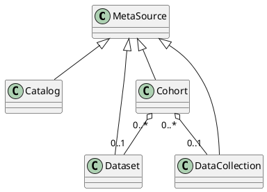

# Metadata Discovery Model

**Cafe Variome V3** can consume, store, serve, and query metadata both locally or as part of a federated network. This guide explains the model of metadata that CV3 accepts, and the principles behind using metadata functions.

## Concept of metadata

Generally, metadata refers to the "data about data." For example, information about a dataset, or about a record inside a dataset. In CV3, the definition is slightly different - metadata refers to the general information on a data collection, either inside of CV3 or hosted somewhere else. The information about a subject does not differentiate between data and metadata, and is all stored inside a data source. Examples of metadata include:

- Name, email or address of the contacting PI
- Name, email or URL for the data publisher
- The license this dataset is released under
- The use conditions or agreement for the data

In general, any information about a collection of data, including dataset, catalog, cohort, etc. can be stored in CV3. This is done via a concept called **Meta Source**.

## Meta sources

A meta-source is a single document representing a dataset or a collection of subject records. Internally, it's stored directly within the corresponding collection of subject records (or dataset) in the database.

The meta-source can link to a dataset inside CV3, meaning that the metadata recorded is for that data source. Alternatively, the meta-source may refer to a dataset outside the system, meaning that the admininistators of the installation are aware of the data, have metadata about it, but cannot or are unwilling to host the data in CV3.

In principle, the metadata recorded in the system is open for discovery, where no authentication is necessary for accessing them. All formats generated by CV3 for these metadata (for example, a <tooltip term="FAIR">FAIR</tooltip> Data Point) will also be
open to the public.

### Meta source types

Meta-sources are designed to be flexible, and can contain extra information with custom fields. There are also pre-defined meta-source models, which fit commonly used metadata models for a given resource type. They can be selected according to the type of data being described, and/or the metadata collected.

We currently have the following pre-defined metadata models:

- **EPND Cohort**: The cohort model used by the [European Platform for Neurodegenerative Disease](https://epnd.org/) to register their collaborative cohorts. An official catalog of cohorts can be found at [EPND Cohort Catalog](https://discover.epnd.org/).
- **Dataset**: A collection of **records** that have been collected for a defined purpose, such as to answer a specific research question. Datasets are atomic, meaning that they cannot be further divided into smaller datasets. As such, all requests and permissions granted apply to the entire dataset.
- **Data collection**: A collection of **datasets** that have been collated for a common purpose, but which can be further divided into smaller collections. For example, all data is collected as part of a given research programme or within a given consortium. Users are only expected to be granted partial access, and hence typically will only request access to a subset of a data collection.
- **Catalog**: A collection of **datasets** and/or **data collections**. Nesting of catalogues is permitted, meaning it is possible to create a "catalog of catalogs."
- **Biobank**: A collection of biological samples (and associated data) collected from patients. These collections are usually based on a certain criteria, for example, a disease or a geographical location.
- **Registry**: A patient registry containing information about patients, usually clinical information, but any information about patients can be stored in a registry.
- **Guideline**: A collection of one or more guidelines for processes relating to a certain disease or a type of data collection.
- **Custom**: This is a general type, and can be used to describe any type of data collection that is not covered in the above types.

> The type of meta-source is used in several places to filter and describe the result. Hence, it is imperative to ensure that the type is correctly assigned. For example, a special collection of records may resemble a dataset, but may be different from a traditional understanding of a dataset. In this case, the custom type should be selected instead of selecting one that resembles the data type.
> {style="note"}

#### Relationship between meta sources

Meta-sources can be related to each other, forming a hierarchy or a graph of metadata. Like the following diagram:

#### Relationship between meta sources and data sources

Meta sources are designed to store metadata. Thus, internally, they can be linked to record level data stored in regular data sources, mainly with the "**belong to**" relationship.

## The Basic model

The structure of the metadata follows a general model. The basic model is used in all cases and is then extended to accommodate other types of data with more detailed fields.

<snippet id="section-internal_fields_and_manual_assignment">

### Internal fields and manual assignment

The fields explained in the sections below are the fields that form the metadata about a given resource. However, there are several other fields used internally within Cafe Variome to enable specific features, like interlinking of metadata entries. These are not visible when using the editing interface,  but may be manually assigned providing the data is **accurate**, and the admin **conforms to the required processes to format them correctly**.

<deflist collapsible="true">
    <def title="sourceId">
        The UUID of the source. If omitted, Cafe Variome will assign a UUID to the source. If present, it should be a valid <a href="https://www.ietf.org/archive/id/draft-ietf-uuidrev-rfc4122bis-11.html#name-uuid-version-4">UUID4 string</a>. This is used within each Cafe Variome instance to identify the source (UUID may not be unique accross instances). It can be used to link one metadata entry to another, for example, by filling the <code>datasetIds</code> fields in the cohort model.
    </def>
    <def title="connectionId">
        The UUID of a <b>data source</b> this metadata entry describes. This is usually only valid when the metadata describes a dataset, but in rare cases can be assigned to other metadata. This field is not recommended to assign directly, as there is no other way to know the UUID of a data source except from checking the database.
    </def>
</deflist>

> Assigning `sourceId` and `connectionId` manually can lead to data inconsistency, and should be done with caution. Always make sure the IDs are present before adding them to the metadata file. If there are only a few IDs to assign, it's better to do it manually in the editing interface.
> {style="warning"}

</snippet>

> See [uploading metadata into Café Variome](uploading-metadata.md) for further guidance on the correct formatting of the metadata.
> {style="note"}

### Common fields definition

These are the fields that are present in all types of meta-sources.

<deflist collapsible="true">
    <def title="sourceId">
        Source ID is a UUID4 compatible code generated by the system. However, if the inputted metadata contains some form of hierarchical structure and the ID is used to denote the parent-child relationship, the ID may be included in a manual uploading file. It must be unique and in UUID4 format for the system to accept it.
    </def>
    <def title="sourceName">
        The name of the source.
    </def>
    <def title="sourceType">
        The type of the source. This is very important, as it determines how this entry is interpreted. It's an enumerable field and can only be one of the following (case-sensitive):
        <deflist type="medium">
            <def title="custom">
                A custom type that is not covered by the following types.
            </def>
            <def title="cohort">
                An EPND Cohort metadata model.
            </def>
            <def title="catalog">
                A catalog of datasets.
            </def>
            <def title="biobank">
                A collection of biological samples.
            </def>
            <def title="registry">
                A patient registry.
            </def>
            <def title="guideline">
                A guideline.
            </def>
            <def title="dataset">
                A collection of records.
            </def>
            <def title="dataCollection">
                A collection of datasets.
            </def>
        </deflist>
    </def>
    <def title="resourceUrls">
        The URLs of the source. They should be fully qualified URLs with schema (e.g. <code>https://example.com/</code>). They should point to the main resource of the source, its description, or any point of interest that a requesting user may need.
    </def>
    <def title="publisher">
        The publisher of the resource. It's a nested JSON object, with the following fields:
        <deflist collapsible="true">
            <def title="publisherType">
                The type of the publisher. It's an enumerable field, can only be one of the following (case sensitive):
                <deflist type="medium">
                    <def title="individual">
                        An individual person.
                    </def>
                    <def title="organization">
                        An organization.
                    </def>
                    <def title="agency">
                        An agency that is not the generator/owner of the resource, but is responsible for managing the resource.
                    </def>
                    <def title="other">
                        Any other type of publisher.
                    </def>
                </deflist>
            </def>
            <def title="name">
                The name of the publisher.
            </def>
            <def title="contactEmail">
                The contact email of the publisher.
            </def>
            <def title="contactName">
                The contact name of the publisher, in case the publisher is not an individual.
            </def>
            <def title="url">
                The URL of the publisher.
            </def>
            <def title="location">
                The location of the publisher. A string containing free text, for example, it can be <code>UK</code> or <code>Leicester, UK, Europe</code>.
            </def>
        </deflist>
    </def>
    <def title="description">
        The description of the source. While it can be left empty, it's recommended to include a description, as this field primarily describes the source and is used for free-text searches.
    </def>
    <def title="themes">
        The themes of the source. This is an array of strings, with each string being a URI to an RDF data structure theme. Useful when a custom theme is required when generating FDP data from this source. If omitted, the default theme will be used.
    </def>
    <def title="releaseLicense">
        The release license of the source. This should be provided as a URL linking to the license. If omitted, the system will assume there is "no license," meaning all rights are reserved, and no permission is granted to use, modify, or distribute the data.
    </def>
    <def title="language">
        The language of the source. It should be a 2-character code adhering to ISO639-1 standard, in lower case.
    </def>
    <def title="customFields">
        The custom fields of the source. It's a key-value or key[values] pairs, where the key is a string, and the value is a string or an array of strings. It's designed to contain the custom metadata in a searchable form. The key cannot contain special characters including dot <code>.</code>, dollar sign <code>$</code>, slash <code>/</code>, or backslash <code>\</code>. If a key is present, the value cannot be <code>null</code> but can be an empty string or an empty array.
    </def>
</deflist>

### Basic model example

The basic model, aka the *Custom* type, expects the following fields:

<include from="library.md" element-id="json-meta_source_custom-maximum"></include>

This metadata model is also used in other meta-source types, where the metadata is similar or same in structure.

## EPND project extensions

### Cohort

#### Cohort fields definition

The cohort model extends the base model to contain more information, specifically the ones deemed necessary in the EPND project. Aside from the fields explained above, it can also have:

<deflist collapsible="true">
    <def title="cohortDetails">
        The details of the cohort. This is a nested JSON object, with the following fields:
        <deflist collapsible="true">
            <def title="siteType">
                The type of the site. It's an enumerable string, being one of the following (case-sensitive):
                <deflist type="medium">
                    <def title="singleSite">
                        A cohort that has only a single site.
                    </def>
                    <def title="multiSite">
                        A cohort that has multiple sites.
                    </def>
                    <def title="multiCountry">
                        A cohort that has multiple sites in multiple countries.
                    </def>
                </deflist>
            </def>
            <def title="country">
                The country of the cohort. It's a 2-character code adhering to the ISO3166-1 standard, in upper case.
            </def>
            <def title="yearStart">
                The year the cohort started. It should be a 4-digit integer.
            </def>
        </deflist>
    </def>
    <def title="collectedTypes">
        The types of data collected for the cohort. This is a nested JSON object, with the following fields:
        <deflist collapsible="true">
            <def title="participants">
                The number of participants in the cohort and their associated conditions. This information is stored in a nested JSON object containing the following fields:
                <deflist collapsible="true">
                    <def title="diseases">
                        The diseases that the participants are categorized by. <em>An empty array will cause the entire <code>participants</code> object to be ignored.</em> This is an array of enumerable strings, each can only be one of the following (case-sensitive):
                        <deflist type="medium">
                            <def title="controlGroup">
                                Control group participants.
                            </def>
                            <def title="ad">
                                Alzheimer's disease.
                            </def>
                            <def title="pd">
                                Parkinson's disease.
                            </def>
                            <def title="irbd">
                                Isolated REM Sleep Behavior Disorder.
                            </def>
                            <def title="dlb">
                                Dementia with Lewy Bodies.
                            </def>
                            <def title="caa">
                                Cerebral Amyloid Angiopathy.
                            </def>
                            <def title="ftd">
                                Frontotemporal Dementia.
                            </def>
                            <def title="als">
                                Amyotrophic Lateral Sclerosis.
                            </def>
                            <def title="psp">
                                Progressive Supranuclear Palsy.
                            </def>
                            <def title="cbd">
                                Corticobasal Degeneration.
                            </def>
                            <def title="msa">
                                Multiple System Atrophy.
                            </def>
                            <def title="hd">
                                Huntington's Disease.
                            </def>
                            <def title="ataxia">
                                Ataxia.
                            </def>
                            <def title="other">
                                Other diseases not listed above.
                            </def>
                        </deflist>
                    </def>
                    <def title="numberOfSubjects">
                        The number of subjects in the cohort. This is a number and should be above 0. <em>If it's 0, the entire <code>participants</code> object will be ignored.</em>
                    </def>
                </deflist>
            </def>
            <def title="bioSamples">
                The types of samples collected in the study. This is an array of enumerable strings, each being one of the following (case-sensitive):
                <deflist type="medium">
                    <def title="csf">
                        Cerebrospinal fluid.
                    </def>
                    <def title="serum">
                        Serum.
                    </def>
                    <def title="plasma">
                        Plasma.
                    </def>
                    <def title="dna">
                        DNA.
                    </def>
                    <def title="saliva">
                        Saliva.
                    </def>
                    <def title="urine">
                        Urine.
                    </def>
                    <def title="stool">
                        Stool.
                    </def>
                </deflist>
            </def>
            <def title="images">
                The types of images collected for the study. This is an array of enumerable strings, each being one of the following (case-sensitive):
                <deflist type="medium">
                    <def title="mri">
                        MRI.
                    </def>
                    <def title="petAmyloid">
                        PET Amyloid.
                    </def>
                    <def title="petTau">
                        PET Tau.
                    </def>
                    <def title="spect">
                        SPECT.
                    </def>
                    <def title="ocular">
                        Ocular.
                    </def>
                </deflist>
            </def>
            <def title="cognitiveData">
                The types of cognitive data collected for the study. This is an array of enumerable strings, each being one of the following (case-sensitive):
                <deflist type="medium">
                    <def title="crossSectional">
                        Cross-sectional data.
                    </def>
                    <def title="longitudinal">
                        Longitudinal data.
                    </def>
                </deflist>
            </def>
        </deflist>
    </def>
    <def title="datasetIds">
        The UUIDs of <code>dataset</code> type metadata entries associated with this cohort. This is an array of strings, where each string is a UUID corresponding to a dataset metadata entry. Each referenced dataset must either be included in the same file or already uploaded to the system.
    </def>
</deflist>

#### Cohort model example

<include from="library.md" element-id="json-meta_source_cohort-maximum"></include>

### Dataset

#### Dataset fields definition

Datasets contain the following fields:

<deflist collapsible="true">
    <def title="datasetVersions">
        The versions of the dataset. This is an array of nested JSON objects, each representing a specific version of the dataset. Each object contains the following fields:
        <deflist collapsible="true">
            <def title="datasetDetails">
                The details of the dataset. This is a nested JSON object, with the following fields:
                <deflist collapsible="true">
                    <def title="versionId">
                        The UUID of the version. If omitted, Cafe Variome will assign a UUID to the version. If present, it should be a valid UUID 4 string. Either way, it will always be present in the database.
                    </def>
                    <def title="versionName">
                        The version number of the dataset. Semantic versioning is recommended. Using a format that does not fit with semantic versioning will disable the parsing, comparison, and sorting of the versions.
                    </def>
                    <def title="keywords">
                        The keywords of the dataset. This is an array of strings, each being a keyword.
                    </def>
                    <def title="publishedDate">
                        The date when the dataset is released. It should be a date string in the format of <code>YYYY-MM-DD</code>.
                    </def>
                    <def title="updateDate">
                        The update date of the dataset. It should be a date string in the format of <code>YYYY-MM-DD</code>.
                    </def>
                </deflist>
            </def>
            <def title="datasetContent">
                The information on the data content of the dataset. It's a nested JSON object, with the following fields:
                <deflist collapsible="true">
                    <def title="numberOfSubjects">
                        The number of data records in the dataset. This should be an integer above 0. It may be an approximated number if the exact number is kept private for confidentiality reasons.
                    </def>
                    <def title="minAge">
                        The minimum age of the participants in the dataset. It should be a number and should be above 0.
                    </def>
                    <def title="maxAge">
                        The maximum age of the participants in the dataset. It should be a number and should be above 0.
                    </def>
                    <def title="countries">
                        The countries of the participants in the dataset. This is an array of 2-character codes adhering to the ISO3166-1 standard, in upper case.
                    </def>
                    <def title="diseases">
                        The diseases of the participants in the dataset. This is an array of enumerable strings, each can only be one of the following (case-sensitive):
                        <deflist type="medium">
                            <def title="controlGroup">
                                Control group participants.
                            </def>
                            <def title="ad">
                                Alzheimer's disease.
                            </def>
                            <def title="pd">
                                Parkinson's disease.
                            </def>
                            <def title="irbd">
                                Isolated REM Sleep Behavior Disorder.
                            </def>
                            <def title="dlb">
                                Dementia with Lewy Bodies.
                            </def>
                            <def title="caa">
                                Cerebral Amyloid Angiopathy.
                            </def>
                            <def title="ftd">
                                Frontotemporal Dementia.
                            </def>
                            <def title="als">
                                Amyotrophic Lateral Sclerosis.
                            </def>
                            <def title="psp">
                                Progressive Supranuclear Palsy.
                            </def>
                            <def title="cbd">
                                Corticobasal Degeneration.
                            </def>
                            <def title="msa">
                                Multiple System Atrophy.
                            </def>
                            <def title="hd">
                                Huntington's Disease.
                            </def>
                            <def title="ataxia">
                                Ataxia.
                            </def>
                            <def title="other">
                                Other diseases not listed above.
                            </def>
                        </deflist>
                    </def>
                    <def title="sex">
                        The genders covered in the dataset. This is an array of enumerable strings, each can only be one of the following (case-sensitive):
                        <deflist type="medium">
                            <def title="male">
                                Biological male.
                            </def>
                            <def title="female">
                                Biological female.
                            </def>
                            <def title="other">
                                Other biological genders.
                            </def>
                            <def title="undifferential">
                                Gender data is irrelevant to the data, or is not differentiated on purpose.
                            </def>
                            <def title="unknown">
                                No information regarding the gender composition or collection status.
                            </def>
                        </deflist>
                    </def>
                    <def title="clinical">
                        The clinical data collected within the dataset. This is an array of enumerable strings, each can only be one of the following (case-sensitive):
                        <deflist type="medium">
                            <def title="comorbidities">
                                Comorbidities.
                            </def>
                            <def title="medicationUse">
                                Medication use.
                            </def>
                            <def title="familyHistory">
                                Family history.
                            </def>
                            <def title="ageOfSymptomOnset">
                                Age of symptom onset.
                            </def>
                            <def title="clinicalDiagnosis">
                                Clinical diagnosis.
                            </def>
                            <def title="exposure">
                                Exposure.
                            </def>
                            <def title="lifeStyleInfo">
                                Lifestyle information.
                            </def>
                            <def title="vitalSigns">
                                Vital signs.
                            </def>
                        </deflist>
                    </def>
                    <def title="markers">
                        The biological or digital markers collected within the dataset. This is an array of enumerable strings, each can only be one of the following (case-sensitive):
                        <deflist type="medium">
                            <def title="amyloid">
                                Amyloid protein markers.
                            </def>
                            <def title="tau">
                                Tau protein markers.
                            </def>
                            <def title="neurofilamentLightChain">
                                Neurofilament light chain protein markers.
                            </def>
                            <def title="alphaSynuclein">
                                Alpha-synuclein protein markers.
                            </def>
                            <def title="dat">
                                Direct Antibody Test.
                            </def>
                        </deflist>
                    </def>
                    <def title="images">
                        <code>array[string]</code> <code>optional</code> The types of images collected within the dataset. This is an array of enumerable strings, each can only be one of the following (case-sensitive):
                        <deflist type="medium">
                            <def title="mri">
                                MRI.
                            </def>
                            <def title="petAmyloid">
                                PET Amyloid.
                            </def>
                            <def title="petTau">
                                PET Tau.
                            </def>
                            <def title="spect">
                                SPECT.
                            </def>
                            <def title="ocular">
                                Ocular.
                            </def>
                        </deflist>
                    </def>
                    <def title="electrophysiology">
                        The types of electrophysiology data collected within the dataset. This is an array of enumerable strings, each can only be one of the following (case-sensitive):
                        <deflist type="medium">
                            <def title="eeg">
                                EEG.
                            </def>
                            <def title="meg">
                                MEG.
                            </def>
                            <def title="erp">
                                ERP.
                            </def>
                        </deflist>
                    </def>
                    <def title="dataTypes">
                        The types of data collected within the dataset. This is an array of enumerable strings, each can only be one of the following (case-sensitive):
                        <deflist type="medium">
                            <def title="demographics">
                                Demographics.
                            </def>
                            <def title="clinical">
                                Clinical.
                            </def>
                            <def title="lifestyle">
                                Lifestyle.
                            </def>
                            <def title="functionalRatings">
                                Functional ratings.
                            </def>
                            <def title="motor">
                                Motor.
                            </def>
                            <def title="neuropsychiatric">
                                Neuropsychiatric.
                            </def>
                            <def title="neuropsychological">
                                Neuropsychological.
                            </def>
                            <def title="qualityOfLife">
                                Quality of life.
                            </def>
                            <def title="sleepScales">
                                Sleep scales.
                            </def>
                            <def title="digitalData">
                                Digital data.
                            </def>
                            <def title="imaging">
                                Imaging.
                            </def>
                            <def title="electrophysiology">
                                Electrophysiology.
                            </def>
                            <def title="neuroPathology">
                                Neuro pathology.
                            </def>
                            <def title="other">
                                Other.
                            </def>
                        </deflist>
                    </def>
                </deflist>
            </def>
        </deflist>
    </def>
</deflist>

The information about each version is stored in the `datasetVersions` field, which is a list. Each version contains the details of the version, and the content of the dataset. Semantic versioning is recommended to enable version comparison and search.

#### Dataset model example

<include from="library.md" element-id="json-meta_source_dataset-maximum"></include>

### Data collection

#### Data collection fields definition

These are the fields specific to the data collection type.

<deflist collapsible="true">
    <def title="dataCollectionDetails">
        The details of the data collection. It's a nested JSON object, with the following fields:
        <deflist collapsible="true">
            <def title="keywords">
                The keywords of the dataset. This is an array of strings, each being a keyword.
            </def>
            <def title="publishedDate">
                The date when the dataset is released. It should be a date string in the format of <code>YYYY-MM-DD</code>.
            </def>
            <def title="updateDate">
                The update date of the dataset. It should be a date string in the format of <code>YYYY-MM-DD</code>.
            </def>
        </deflist>
    </def>
    <def title="dataCollectionContent">
        The information on the data content of the data collection. It's a nested JSON object, with the following fields:
        <deflist collapsible="true">
            <def title="numberOfSubjects">
                The amount of data records in the dataset. It should be a number and should be above 0. It may be an approximated number if the exact number is kept private for confidentiality reasons.
            </def>
            <def title="minAge">
                The minimum age of the participants in the dataset. It should be a number and should be above 0.
            </def>
            <def title="maxAge">
                The maximum age of the participants in the dataset. It should be a number and should be above 0.
            </def>
            <def title="countries">
                The countries of the participants in the dataset. This is an array of 2-character codes adhering to the ISO3166-1 standard, in upper case.
            </def>
            <def title="diseases">
                The diseases of the participants in the dataset. This is an array of enumerable strings, each can only be one of the following (case-sensitive):
                <deflist type="medium">
                    <def title="controlGroup">
                        Control group participants.
                    </def>
                    <def title="ad">
                        Alzheimer's disease.
                    </def>
                    <def title="pd">
                        Parkinson's disease.
                    </def>
                    <def title="irbd">
                        Isolated REM Sleep Behavior Disorder.
                    </def>
                    <def title="dlb">
                        Dementia with Lewy Bodies.
                    </def>
                    <def title="caa">
                        Cerebral Amyloid Angiopathy.
                    </def>
                    <def title="ftd">
                        Frontotemporal Dementia.
                    </def>
                    <def title="als">
                        Amyotrophic Lateral Sclerosis.
                    </def>
                    <def title="psp">
                        Progressive Supranuclear Palsy.
                    </def>
                    <def title="cbd">
                        Corticobasal Degeneration.
                    </def>
                    <def title="msa">
                        Multiple System Atrophy.
                    </def>
                    <def title="hd">
                        Huntington's Disease.
                    </def>
                    <def title="ataxia">
                        Ataxia.
                    </def>
                    <def title="other">
                        Other diseases not listed above.
                    </def>
                </deflist>
            </def>
            <def title="sex">
                The genders covered in the dataset. This is an array of enumerable strings, each can only be one of the following (case-sensitive):
                <deflist type="medium">
                    <def title="male">
                        Biological male.
                    </def>
                    <def title="female">
                        Biological female.
                    </def>
                    <def title="other">
                        Biological other.
                    </def>
                    <def title="undifferential">
                        Gender data is irrelevant to the data, or is not differentiated on purpose.
                    </def>
                    <def title="unknown">
                        No information regarding the gender composition or collection status.
                    </def>
                </deflist>
            </def>
            <def title="clinical">
                The clinical data collected within the dataset. This is an array of enumerable strings, each can only be one of the following (case-sensitive):
                <deflist type="medium">
                    <def title="comorbidities">
                        Comorbidities.
                    </def>
                    <def title="medicationUse">
                        Medication use.
                    </def>
                    <def title="familyHistory">
                        Family history.
                    </def>
                    <def title="ageOfSymptomOnset">
                        Age of symptom onset.
                    </def>
                    <def title="clinicalDiagnosis">
                        Clinical diagnosis.
                    </def>
                    <def title="exposure">
                        Exposure.
                    </def>
                    <def title="lifeStyleInfo">
                        Lifestyle information.
                    </def>
                    <def title="vitalSigns">
                        Vital signs.
                    </def>
                </deflist>
            </def>
            <def title="markers">
                The biological or digital markers collected within the dataset. This is an array of enumerable strings, each can only be one of the following (case-sensitive):
                <deflist type="medium">
                    <def title="amyloid">
                        Amyloid protein markers.
                    </def>
                    <def title="tau">
                        Tau protein markers.
                    </def>
                    <def title="neurofilamentLightChain">
                        Neurofilament light chain protein markers.
                    </def>
                    <def title="alphaSynuclein">
                        Alpha-synuclein protein markers.
                    </def>
                    <def title="dat">
                        Direct Antibody Test.
                    </def>
                </deflist>
            </def>
            <def title="images">
                The types of images collected within the dataset. This is an array of enumerable strings, each can only be one of the following (case-sensitive):
                <deflist type="medium">
                    <def title="mri">
                        MRI.
                    </def>
                    <def title="petAmyloid">
                        PET Amyloid.
                    </def>
                    <def title="petTau">
                        PET Tau.
                    </def>
                    <def title="spect">
                        SPECT.
                    </def>
                    <def title="ocular">
                        Ocular.
                    </def>
                </deflist>
            </def>
            <def title="electrophysiology">
                The types of electrophysiology data collected within the dataset. This is an array of enumerable strings, each can only be one of the following (case-sensitive):
                <deflist type="medium">
                    <def title="eeg">
                        EEG.
                    </def>
                    <def title="meg">
                        MEG.
                    </def>
                    <def title="erp">
                        ERP.
                    </def>
                </deflist>
            </def>
            <def title="dataTypes">
                The types of data collected within the dataset. This is an array of enumerable strings, each can only be one of the following (case-sensitive):
                <deflist type="medium">
                    <def title="demographics">
                        Demographics.
                    </def>
                    <def title="clinical">
                        Clinical.
                    </def>
                    <def title="lifestyle">
                        Lifestyle.
                    </def>
                    <def title="functionalRatings">
                        Functional ratings.
                    </def>
                    <def title="motor">
                        Motor.
                    </def>
                    <def title="neuropsychiatric">
                        Neuropsychiatric.
                    </def>
                    <def title="neuropsychological">
                        Neuropsychological.
                    </def>
                    <def title="qualityOfLife">
                        Quality of life.
                    </def>
                    <def title="sleepScales">
                        Sleep scales.
                    </def>
                    <def title="digitalData">
                        Digital data.
                    </def>
                    <def title="imaging">
                        Imaging.
                    </def>
                    <def title="electrophysiology">
                        Electrophysiology.
                    </def>
                    <def title="neuroPathology">
                        Neuro pathology.
                    </def>
                    <def title="other">
                        Other.
                    </def>
                </deflist>
            </def>
        </deflist>
    </def>
</deflist>

#### Data collection model example

<include from="library.md" element-id="json-meta_source_data_collection-maximum"></include>

<seealso>
    <category ref="related">
        <a href="uploading-metadata.md"/>
        <a href="fdp-integration.md"/>
        <a href="query-builder-and-query-result.md"/>
    </category>
</seealso>