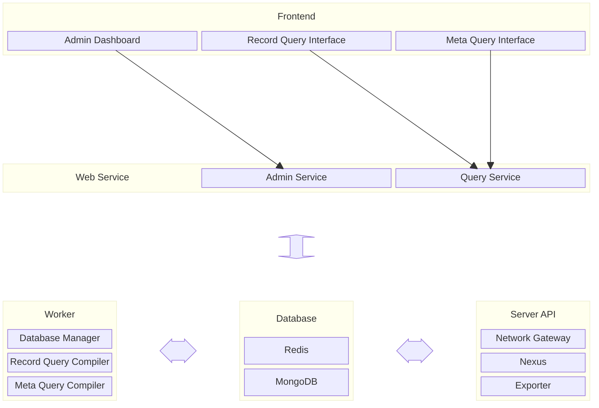

# System Structure

Cafe Variome V3 consists of multiple components, following a microservice architecture. The entire system can be illustrated in the following diagram:

## Frontend

The CV3 frontend consists of three separate components:

- **Admin Dashboard**: The admin dashboard is a web application that provides an interface for system administrators to manage the system. If the system is fully configured and running, the admin dashboard can optionally be removed without affecting the query interface.
- **Record Query Interface**: The record query interface is a web application that provides an interface for users to query the database for individual records. The record query compiler needs to be running for this interface to work.
- **Meta Query Interface**: The meta query interface is a web application that provides an interface for users to query the database for metadata. The meta query compiler needs to be running for this interface to work.

## Web Service

The web service layer has two Quart services:

- **Admin Service**: The admin service provides an API for the admin dashboard to interact with the system. It is a Quart service that provides endpoints for the admin dashboard to manage the system. It also has a GraphQL endpoint, allows querying and modification of the operational data with GraphQL.
- **Query Service**: The query service provides an API for the query interfaces to interact with the system. It is a Quart service that provides endpoints for the query interfaces to query the database. It also accepts other commonly used query languages such as FDP (SPARQL) and BEACON.

## Worker

The workers are non-web services that spawn multiple processes to handle background tasks. The workers are:

- **Database Manager**: The database manager is a worker that manages the database background operations, such as index building, database cleanup, data ingestion, etc.
- **Record Query Compiler**: The record query compiler is a worker that transforms record query requests from the record query interface into database queries, executes them, and returns the results.
- **Meta Query Compiler**: The meta query compiler is a worker that converts meta query requests from the meta query interface into database queries, executes them, and returns the results.

## Database

The database layer consists of two databases:

- **Redis**: This is used as a cache and message broker for the system. It is used to store temporary data and to communicate between different components of the system.
- **MongoDB**: This is used as the primary database for the system, storing all the data and metadata.

## Server API

The server APIs are the APIs dedicated to server-to-server communication. They are intended to connect to other supported services, and may use different authentication methods based on the targeting system. The server APIs are:

- **Network Gateway**: The network gateway is the federated gateway for the system. It's used to create a fully decentralised data discovery network with other CV3 instances, and to translate all queries to the local database.
- **Nexus**: The nexus is a legacy API used to provide networking function for Cafe Variome V2 instances. CV2 uses a centralised discovery network model, so the nexus component is used to act as the registry server, and bridges the queries between CV2 and CV3.
- **Exporter**: The exporter is a service that provides metrics monitoring functionalities for the system. It collects the metrics from Redis, and exposes them in Prometheus format for monitoring.

<seealso>
    <category ref="related">
        <a href="file-structure.md"/>
        <a href="convention.md"/>
        <a href="data-model.md"/>
    </category>
</seealso>